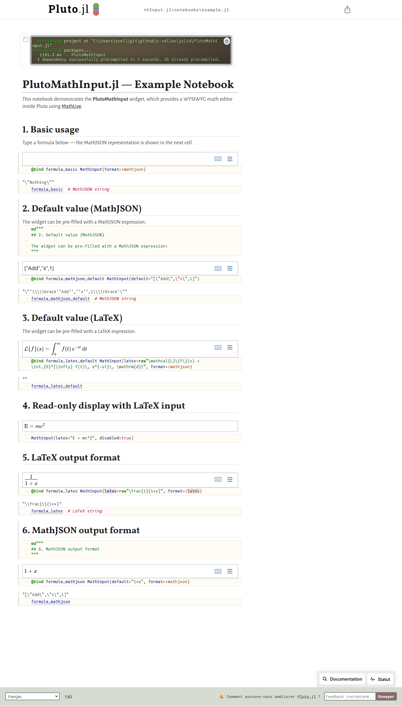
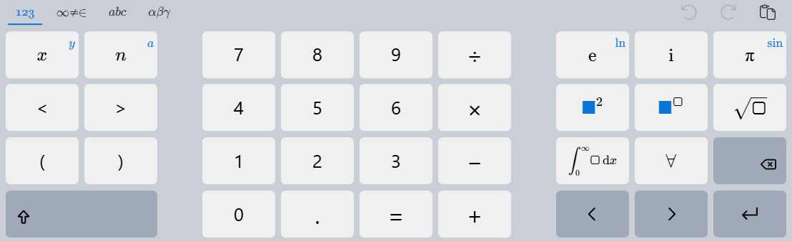
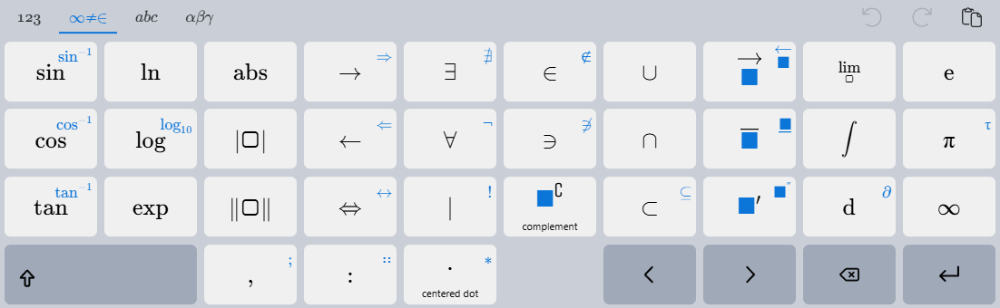
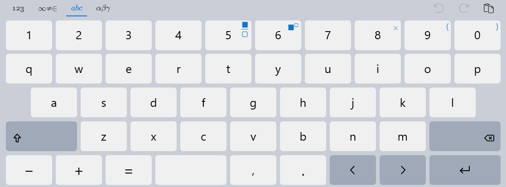
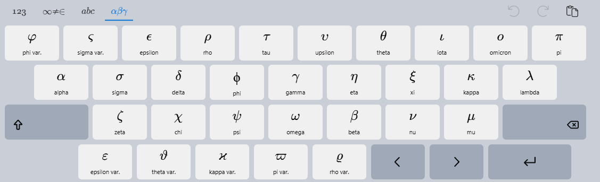

# PlutoMathInput.jl

A [Pluto.jl](https://github.com/JuliaPluto/Pluto.jl) widget for WYSIWYG mathematical formula input, powered by [MathLive](https://mathlive.io/).







## Features

- 📝 **WYSIWYG math editor** — type formulas visually with TeX-quality rendering
- 🔗 **`@bind` compatible** — works seamlessly with Pluto's reactivity
- 📦 **MathJSON output** — interoperable with [MathJSON.jl](https://github.com/s-celles/MathJSON.jl)
- 🧮 **Symbolics.jl integration** — optional conversion to symbolic expressions
- ⌨️ **Virtual keyboard** — touch-friendly math keyboard on mobile devices
- 🔄 **Multiple output formats** — MathJSON, LaTeX, or Symbolics.Num

## Installation

```julia
using Pkg
Pkg.add(url="https://github.com/s-celles/PlutoMathInput.jl")
```

## Quick Start

```julia
using PlutoMathInput

# Basic input — returns MathJSON string
@bind formula MathInput()

# With MathJSON default value
@bind formula MathInput(default="""["Add", "x", 1]""")

# With LaTeX default
@bind formula MathInput(latex="\\frac{x^2+1}{2}")

# Read-only display
MathInput(latex="E = mc^2", disabled=true)

# LaTeX output format
@bind tex MathInput(format=:latex)
```

## With MathJSON.jl

```julia
using PlutoMathInput, MathJSON

@bind formula MathInput()
expr = parse(MathJSONFormat, formula)
```

## With Symbolics.jl

```julia
using PlutoMathInput, Symbolics

# Direct symbolic output
@bind sym_expr MathInput(format=:symbolics)
```

## Options

| Parameter | Type | Default | Description |
|-----------|------|---------|-------------|
| `default` | `String` | `""` | Default value as MathJSON |
| `latex` | `String` | `""` | Default value as LaTeX |
| `format` | `Symbol` | `:mathjson` | Output: `:mathjson`, `:latex`, `:symbolics` |
| `disabled` | `Bool` | `false` | Read-only mode |
| `style` | `String` | `""` | CSS style for container |
| `options` | `Dict` | `Dict()` | MathLive options |
| `macros` | `Dict` | `Dict()` | Custom LaTeX macros |

## Example Notebook

Open `notebooks/example.jl` in Pluto for an interactive demo.

## Related Projects

- [MathLive](https://mathlive.io/) — the math editing library powering this widget ([GitHub](https://github.com/arnog/mathlive))
- [`<math-field>`](https://mathlive.io/mathfield/) — the web component (custom element) providing the interactive math input field
- [MathJSON](https://cortexjs.io/math-json/) — a JSON representation for mathematical expressions ([specification](https://cortexjs.io/math-json/))
- [MathJSON.jl](https://github.com/s-celles/MathJSON.jl) — Julia package to parse and manipulate MathJSON expressions
- [Compute Engine](https://cortexjs.io/compute-engine/) — JavaScript symbolic computation engine by [CortexJS](https://cortexjs.io/)

## License

MIT
